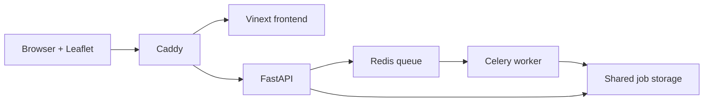

# Crop Row Gap Analyzer

An open-source web application for comparing the paper's three non-Hough
row-gap methods against a georeferenced RGB orthomosaic:

- Fourier / FFT baseline
- Strip tracking without dynamic birth
- Strip tracking with dynamic birth

The user uploads a GeoTIFF (up to 500 MB), selects the minimum gap distance,
starts one asynchronous analysis for all three methods, switches between their
orthomosaic overlays in Leaflet, and downloads the selected method's per-row
CSV.

## Architecture



All runtime components are open source:

- Leaflet with a satellite imagery basemap for the browser map
- FastAPI for upload, status, GeoJSON, CSV, and raster tile endpoints
- Celery and Redis for background analysis
- Rasterio/GDAL, Rio-Tiler, OpenCV, SciPy, and the supplied research scripts
- Caddy as the same-origin reverse proxy

## Run

Requirements: Docker Engine with the Compose plugin and at least 8 GB RAM.
More memory is recommended for large or high-resolution orthomosaics.

```bash
cp .env.example .env
docker compose up --build
```

Open `http://localhost:8080`.

The first build downloads the Python geospatial packages and JavaScript
dependencies. Submitted inputs and generated outputs remain in the Docker
volume `analysis_data`.

## Input requirements

- `.tif` or `.tiff`
- maximum size: 500 MB
- at least three RGB bands
- a valid CRS and affine geotransform

The pipeline derives GSD from a projected GeoTIFF. A geographic source is
reprojected to the local UTM zone by the supplied analysis code before metric
gap measurement.

## Outputs

Each successful job exposes:

- tiled orthomosaic for Leaflet
- per-method WGS 84 row-centerline GeoJSON
- per-method WGS 84 detected-gap GeoJSON
- per-method CSV with row length, number of gaps, gap length, and gap percentage
- per-method summary values for detected rows, gaps, total gap length, and
  overall gap rate

## Operations

Only one worker process is enabled by default because a single analysis can be
memory intensive. Increase `WORKER_CONCURRENCY` only when the host has enough
RAM for multiple orthomosaics.

For a remote Ubuntu server, place TLS and authentication in front of Caddy
before exposing the application publicly. Job retention and user accounts are
deliberately outside this first release.
